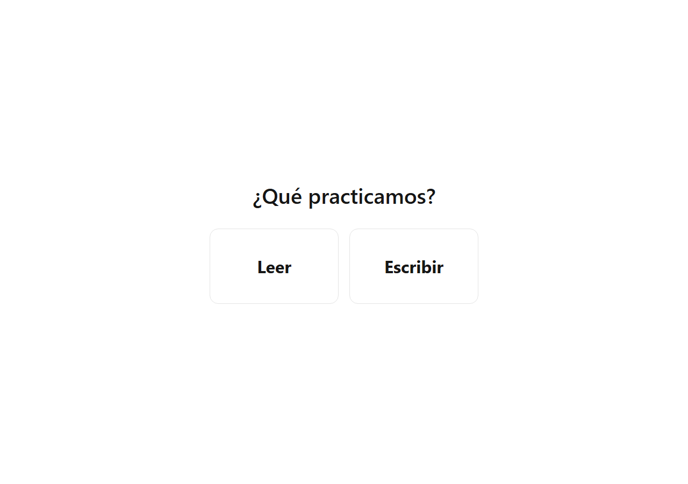
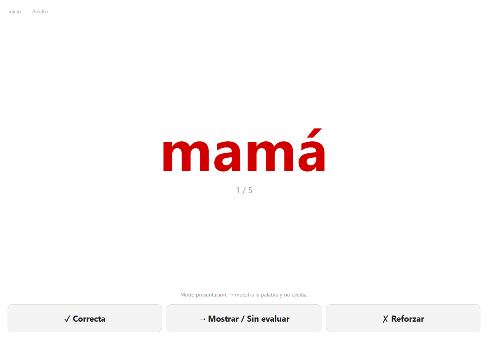
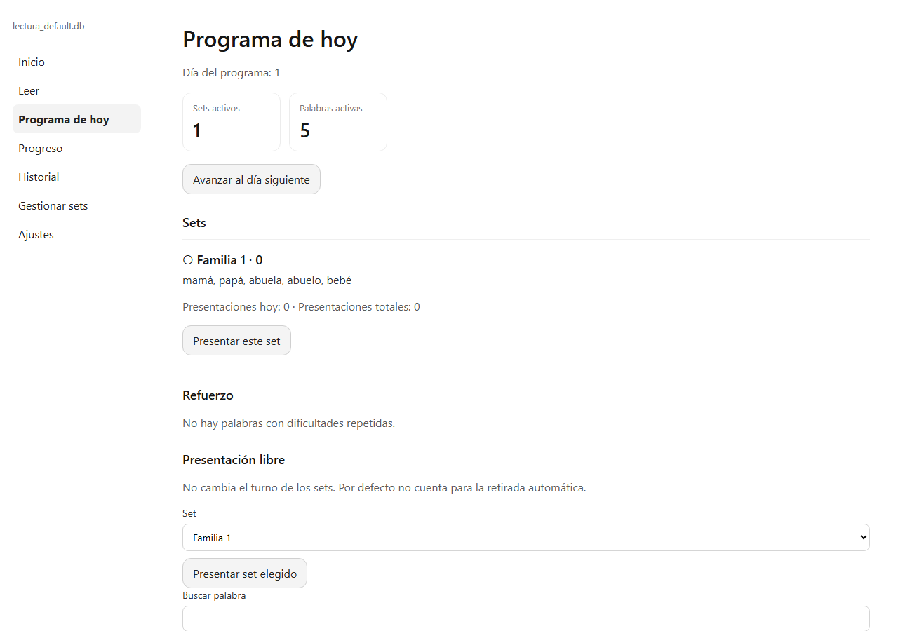
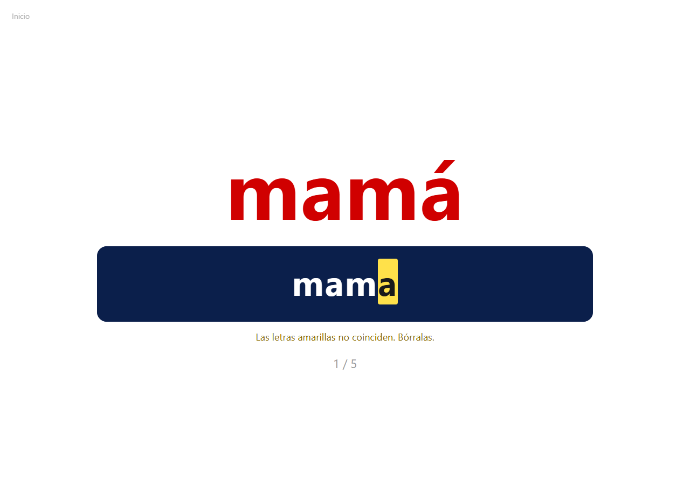

# Lectura temprana

Aplicación local para practicar palabras sueltas en español con un niño pequeño. Al abrirla se elige **Leer** o **Escribir**. Las dos usan los mismos sets. La escritura se guarda aparte, en la misma base SQLite, y no altera la lectura.

Python 3.12. La pantalla es una página web en este ordenador. No hay cuentas ni servicios en la nube.



## Para qué sirve

El programa sigue la estructura práctica del método de Glenn Doman, tal como lo expone en *How to Teach Your Baby to Read* (1964; en español, *Cómo enseñar a leer a su bebé*).

En ese libro la lectura empieza por la palabra entera, no por la letra suelta. La palabra se muestra grande, en rojo, sobre un fondo limpio, durante un instante, y el adulto la dice en voz alta. Las sesiones son muy breves y frecuentes. Las palabras van en grupos pequeños. El niño no hace un examen: ver la palabra y oírla ya es la lección.

Esta aplicación guarda esa idea:

- Una palabra cada vez, grande y centrada, sobre fondo blanco. El tamaño es el mismo para todas: 150 px.
- El color inicial es el rojo.
- Los grupos son sets temáticos de 5 palabras. El día 1 abre con la familia: mamá, papá, abuela, abuelo, bebé.
- La sesión no salta sola al set siguiente. Al terminar, el adulto elige repetir, seguir o volver.
- Mostrar la palabra sin puntuar es un resultado de pleno derecho. El botón **→ Mostrar / Sin evaluar** guarda la exposición y no la cuenta como fallo.

Lo que el libro no pide, y la aplicación sí ofrece, es un registro opcional. **✓ Correcta** y **✗ Reforzar** anotan una lectura evaluada si el adulto quiere llevarla. Se puede usar el programa durante mucho tiempo solo con **→**.

**Escribir** es una práctica añadida. El niño copia la palabra roja. Ese intento vive en tablas propias y no cambia la precisión de la lectura ni la retirada de los sets.

## Leer

La pantalla del niño muestra la palabra, el avance `1 / 5` y tres botones. No muestra porcentajes.

| Botón | Qué anota |
| --- | --- |
| ✓ Correcta | La ha leído por su cuenta |
| → Mostrar / Sin evaluar | Se le ha mostrado o leído, sin examen |
| ✗ Reforzar | Lo ha intentado y no la ha leído |

La flecha derecha o la barra espaciadora equivalen a **→**, salvo que el foco esté en un campo de texto.



**Inicio** vuelve a la elección. **Adulto** abre el programa: el día, los sets activos, el refuerzo y la presentación libre.



Hay otras dos formas de pintar la palabra, negro y letra central en rojo. Las tres, junto con mayúsculas, día del programa, retirada y perfiles, están en el [manual](docs/manual.md).

## Escribir

La palabra modelo sale en rojo, centrada. Debajo, el recuadro azul oscuro recibe lo que se teclea, en blanco. El texto nace en el centro y crece hacia los dos lados, para que la mirada no tenga que recorrer el renglón de izquierda a derecha.

Si lo escrito coincide con la palabra, pasa solo a la siguiente y queda guardado como correcto. Si una letra no coincide, se marca en amarillo para borrarla. Enter guarda ese intento como incorrecto y deja el texto en pantalla. En la imagen, `mamá` se ha escrito `mama`: la última letra no lleva el acento y queda en amarillo.



El turno de escritura usa los mismos sets activos y rota con sus propias sesiones. El detalle está en el [manual](docs/manual.md#escribir).

## Puesta en marcha

Desde la carpeta `reading_app`, con Python 3.12:

```bash
pip install -r requirements.txt
python -m uvicorn app:app --host 127.0.0.1 --port 8000
```

Abre http://127.0.0.1:8000

En Windows, si `python` no es 3.12:

```bash
py -3.12 -m pip install -r requirements.txt
py -3.12 -m uvicorn app:app --host 127.0.0.1 --port 8000
```

La primera ejecución crea el vocabulario de `data/` y la base `data/databases/lectura_default.db` si todavía no existen.

Los ajustes, el día del programa, los sets, el vocabulario Excel y las copias de seguridad están explicados en el [manual](docs/manual.md).
