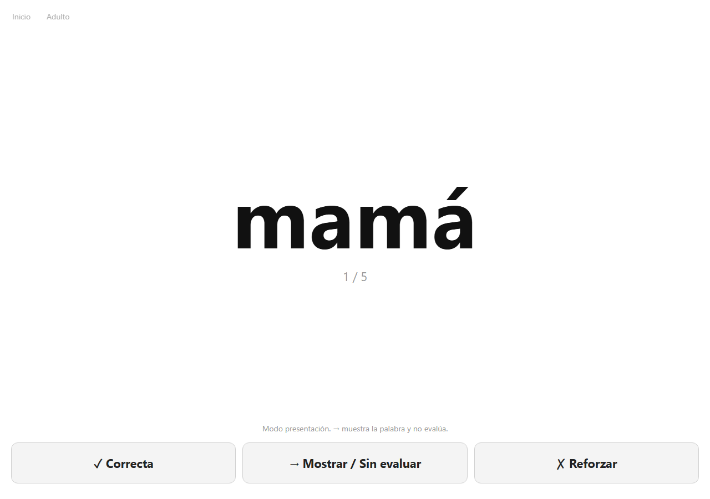
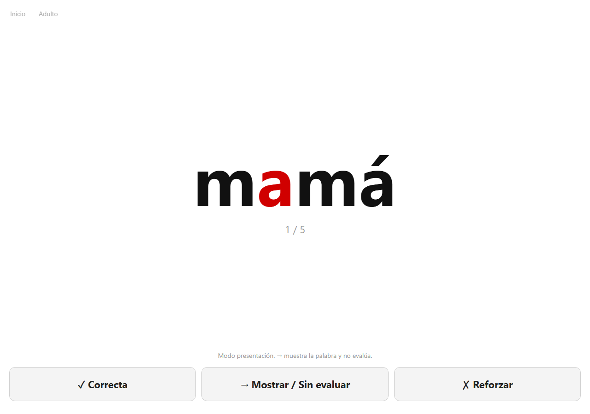

# Manual

Ajustes y reglas del programa. La puesta en marcha corta está en el [README](../README.md).

Las capturas usan el vocabulario inicial, el día 1 y la palabra `mamá`.

## Leer

### Tres formas de mostrar la palabra

Se eligen en **Ajustes → Aspecto de la palabra**. Las tres comparten fondo blanco, palabra centrada y el mismo tamaño, 150 px. Una palabra corta y una larga ocupan la misma altura.

**Doman / palabra en rojo.** Toda la palabra en rojo. Es el modo inicial y el más cercano al libro: la palabra se ve de un golpe.


**Negro.** La misma palabra, sin realce de color.



**Letra central en rojo.** El resto va en negro. La letra marcada es la del centro, contando caracteres. Si la longitud es par, se marca la anterior de las dos centrales. En `sol` es la `o`; en `gato`, la `a`; en `perro`, la `r`. En `mamá` (cuatro letras) es la segunda, la `a`.



El modo se aplica al abrir la sesión. Si se cambia en Ajustes a mitad de un set, el set que ya está en pantalla conserva el aspecto con el que empezó.

### Mayúsculas

En **Ajustes → Mayúsculas**:

| Opción | Ejemplo |
| --- | --- |
| Minúsculas | mamá. Es el valor inicial |
| Mayúsculas | MAMÁ. Los acentos se conservan: niño pasa a NIÑO |
| Como está escrito | La forma guardada en el Excel |

En Escribir, el niño copia la forma que se está mostrando. Si la pantalla dice `MAMÁ`, esa es la cadena que cuenta como correcta.

### Modo presentación y modo seguimiento

**Modo presentación** es el inicial. Sirve para enseñar. El recorrido habitual es pulsar **→** en cada palabra. ✓ y ✗ siguen ahí por si el adulto quiere anotar una lectura.

**Modo seguimiento** usa los mismos tres botones. El adulto puede evaluar unas palabras y dejar otras como exposición. El programa funciona bien aunque casi todas las sesiones sean solo **→**.

La nota gris bajo la palabra («Modo presentación. → muestra la palabra y no evalúa.») solo aparece en modo presentación.

### Los tres botones

| Botón | Cuándo | Qué se guarda |
| --- | --- | --- |
| ✓ Correcta | El niño ha leído la palabra por su cuenta | `correct` |
| → Mostrar / Sin evaluar | Se le ha mostrado o leído, sin examen | `exposure` |
| ✗ Reforzar | Lo ha intentado y no la ha leído | `incorrect` |

Los tres pasan enseguida a la siguiente palabra. Los tres cuentan como presentación:

```text
presentaciones = exposiciones + correctas + incorrectas
```

La precisión solo usa los intentos evaluados:

```text
precisión = correctas / (correctas + incorrectas)
```

Si no ha habido ✓ ni ✗, **Progreso** dice **Sin evaluar**, no 0 %.

En Leer, la flecha derecha o la barra espaciadora registran una exposición, siempre que el foco no esté en un campo de texto.

Al terminar el set:

```text
Set completado
Presentar de nuevo · Siguiente set · Volver
```

La aplicación no encadena sola la sesión siguiente.

La pantalla del niño no muestra porcentajes. Esos números están en **Progreso** y en **Historial**, detrás de **Adulto**.

## Día del programa

El día del programa no es el día del calendario. Vive en la base SQLite y solo cambia cuando el adulto pulsa **Avanzar al día siguiente** en **Programa de hoy** o en **Ajustes**.

Se puede saltar un sábado sin que el programa dé por hecho que ya toca el día siguiente. Si cambia la fecha del ordenador, la aplicación lo sugiere en las páginas de adulto y no modifica nada sola.

Progresión inicial, con los valores por defecto:

```text
Día 1:  1 set activo   (5 palabras)
Día 2:  2 sets activos (10 palabras)
Día 3:  3 sets activos (15 palabras)
Día 4:  4 sets activos (20 palabras)
Día 5+: hasta 5 sets activos (unas 25 palabras)
```

`Palabras por set` y `Máximo de sets activos` se cambian en Ajustes. Los valores iniciales son 5 y 5. Al llegar al máximo, un set nuevo entra cuando se retira uno de los activos.

El número junto al nombre del set en **Programa de hoy** es cuántas veces se ha presentado ese set en el día del programa. En la captura, Familia 1 lleva 0 porque todavía no se ha pulsado ningún botón de lectura.


## Sets y vida de una palabra

La unidad del programa es un set temático, no una tarjeta suelta con su propio calendario.

Un set normal tiene 5 palabras relacionadas. Si una categoría da para más de un set, se numeran: `Familia 1`, `Familia 2`, `Animales 1`. Si solo cabe un set, el nombre no lleva número. El programa no mezcla categorías al crear esos sets.

Cada palabra pasa por Disponible, Activa y Retirada. Cada set pasa por Planificado, Activo y Retirado.

Retirar no borra el historial. Las presentaciones, las sesiones y las estadísticas siguen guardadas. Una palabra retirada no vuelve sola a los sets básicos. En **Gestionar sets** se puede crear un set manual con palabras ya retiradas si el adulto quiere recuperarlas.

Dentro del set, el orden de las palabras se baraja en cada sesión si **Barajar dentro del set** está encendido. Es el valor inicial. La presentación libre de palabras elegidas a mano no se baraja.

### Retirada

Un set puede alcanzar el criterio de retirada cuando todas sus palabras cumplen las dos cosas:

- un número de presentaciones que cuentan para la retirada (por defecto 15);
- un número de días de programa desde que entraron (por defecto 5).

Los días de una palabra son `día del programa − día en que entró + 1`.

**Retirada automática** está apagada por defecto. El programa avisa, por ejemplo «Familia ha alcanzado el criterio de retirada», y ofrece **Retirar set**. Si se enciende, al avanzar el día sustituye los sets que ya cumplen el criterio. Abrir la aplicación no retira nada por sí sola.

La presentación libre y la sesión de refuerzo se guardan en el historial. Por defecto no cuentan para ese criterio. Hay un ajuste, **La presentación libre cuenta para la retirada**, para que la presentación libre sí cuente.

## Refuerzo

Un fallo no saca la palabra de su set. Sube un `reinforcement_score`. Un acierto lo baja un poco (medio punto, sin bajar de cero). Con dificultades repetidas, a partir de una puntuación de 2, **Programa de hoy** ofrece una **Sesión de refuerzo**, aparte del turno normal. Esa sesión no cuenta para la retirada.

La exposición neutra no mueve esa puntuación.

## Presentación libre

En **Programa de hoy** se puede presentar un set ya creado o unas palabras elegidas, sin alterar el turno del programa. La sesión queda como `manual`.

## Escribir

Escribir usa los sets activos y el día del programa de la lectura. La palabra modelo va siempre en rojo, también si Leer está en negro o en letra central.

El recuadro es azul oscuro (`#0b1f4b`). Las letras correctas son blancas. El texto se centra: la primera letra aparece en el medio y las siguientes empujan el conjunto hacia los dos lados.

La comparación es exacta, carácter a carácter, incluida la forma de mayúsculas que se está mostrando. `a` y `á` no son la misma letra.

- Si el texto coincide, la aplicación guarda `correct` y pasa a la palabra siguiente.
- Si no coincide, las letras distintas, y las que sobran al final, se marcan en amarillo.
- Enter con el texto todavía distinto guarda `incorrect` y deja esas letras para borrarlas. Al corregirlas hasta igualar la palabra, pasa sola a la siguiente.


Al cerrar el set aparecen **Escribir de nuevo**, **Siguiente set** y **Volver**. **Progreso**, arriba a la derecha, lista solo las escrituras: intentos, correctas, incorrectas y precisión. Esa precisión es `correctas / (correctas + incorrectas)` de la escritura.

Las tablas son `writing_sessions`, `writing_presentations` y `writing_word_stats`, en el mismo archivo SQLite que la lectura. Un intento de escritura no suma lecturas correctas ni incorrectas, no cambia la precisión de Leer y no cuenta para la retirada. El turno de qué set toca escribir mira las sesiones de escritura, no las de lectura.

## Vocabulario

Excel dice qué palabras existen. SQLite dice qué está pasando en el programa: día, sets activos, presentaciones, escrituras, retiradas y ajustes.

### Mis palabras

`data/mis_palabras.xlsx` es el currículo principal. Unas cien palabras concretas, en categorías como familia, animales, cuerpo, casa, comida, juguetes, naturaleza, colores, acciones y otros.

```text
word
category
enabled
```

`enabled` en 1 incluye la palabra; en 0 la deja fuera de los sets nuevos.

El día 1 sale de aquí, empezando por lo más cercano al niño (familia, animales, cuerpo, casa). No empieza por `de`, `que`, `el` o `la`.

### Frecuencia español

`data/frecuencia_espanol.xlsx` es una lista orientada a la frecuencia, curada para esta aplicación. No es la exportación de un corpus documentado. El orden de `rank` es práctico, no un recuento de un banco de datos.

```text
rank
word
enabled
```

Sirve de reserva. En Ajustes, **Fuente de nuevas palabras** puede ser:

- Mis palabras (valor inicial)
- Frecuencia
- Ambas

Las palabras de función (`de`, `que`, `el`, `la`…) se planifican después de las palabras con contenido, en sets llamados `Función`.

### Cómo editar las listas

1. Cierra el Excel si la aplicación va a leerlo.
2. Edita `data/mis_palabras.xlsx` o `data/frecuencia_espanol.xlsx`.
3. En Ajustes, pulsa **Sincronizar vocabulario Excel**.

La sincronización añade o actualiza palabras. No reconstruye el historial ni vuelve a meter en el turno básico una palabra que ya perteneció a un set.

La misma forma escrita no se reutiliza en otro origen si ya está en un set del programa.

## Bases de datos y perfiles

Cada archivo de `data/databases/` es un programa independiente. Cambiar de base cambia palabras activas, sets, día, historial y estadísticas. El Excel es común.

```text
data/databases/lectura_default.db
data/databases/programa_nuevo.db
```

En **Ajustes → Base de datos / Perfil** se puede:

- elegir la base activa;
- crear una nueva, por ejemplo `lectura_octubre`, vacía de historial y empezando en el día 1;
- hacer una copia de seguridad;
- restablecer el progreso;
- recrear la base;
- apartar una base secundaria.

La base activa se recuerda en `data/app_config.db`.

### Copia de seguridad

**Crear copia de seguridad** usa la copia de SQLite y escribe en `data/backups/` un archivo con fecha y hora, por ejemplo:

```text
lectura_default_backup_2026-09-21_1630.db
```

### Restablecer progreso

Borra el día, los sets, las sesiones, las presentaciones, las escrituras y las estadísticas de la base actual, y vuelve a abrir el día 1. No borra los Excel. Hay que escribir `REINICIAR`. Los ajustes (palabras por set, modos de pantalla, etc.) se conservan.

### Recrear base de datos

Hace primero una copia, cierra el archivo, crea el esquema de nuevo, vuelve a leer el Excel y empieza en el día 1. Hay que escribir `RECREAR`.

### Apartar una base

No se puede retirar la única base que queda. La base apartada se mueve a `data/backups/`. Hay que escribir el nombre del archivo, por ejemplo `programa_nuevo.db`.

## Páginas

- **Inicio.** Elige Leer o Escribir.
- **Leer.** La palabra y los botones.
- **Escribir.** La palabra en rojo y el recuadro para copiarla. Su progreso está en esa misma pantalla.
- **Programa de hoy.** Día, sets activos, presentaciones de hoy y totales, aviso de retirada, refuerzo y presentación libre.
- **Progreso.** Totales de lectura y tabla por palabra. La precisión evaluada ignora las exposiciones neutras.
- **Historial.** Por fecha, día del programa, set o palabra. Es el historial de lectura.
- **Gestionar sets.** Ver, renombrar, activar, retirar, reordenar los planificados y crear un set.
- **Ajustes.** Pantalla, ritmo del programa, retirada y bases de datos.

## Dónde está cada cosa

```text
app.py                      servidor local
web/                        pantalla del navegador
src/web_api.py              API que usa el programa
src/doman_scheduler.py      sets, días, retirada y sesiones de lectura
src/writing.py              sesiones de escritura
src/database_manager.py     perfiles, copias, reinicio
src/database.py             esquema SQLite
src/word_loader.py          lectura del Excel
src/display.py              color, mayúsculas y tamaño
src/statistics.py           precisión e informes de lectura
data/                       Excel, bases y copias
docs/manual.md              este manual
```

Las pruebas, desde `reading_app`:

```bash
py -3.12 -m pytest
```
